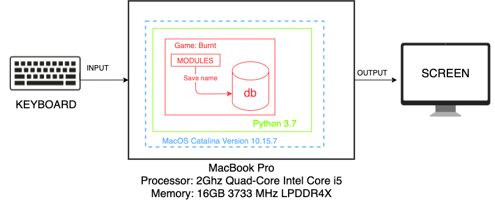

# Unit 1: A classic game 

# Criteria A: Planning

## Problem definition

The owner of the local game shop is an enthusiast of classic computer games. He has been looking for a talented programmer that can help him revive his passion for text-based games. He has few requirements for this task:

1. The game has to be entirely text-based.
2. The game must record the time played.
3. The game must record the player name and score.

Apart for this requirements, the owner is open to any type of game, topic or genre.

## Proposed Solution

## Success Criteria
### 1. The game has to be entirely text-based.
### 2. The game must record the time played.
### 3. The game must record the player's name and score.
### 4. The game will provide a checkpoint for each chapter.
### 5. The game will have a survey at the end which measures the satisfactory level.
### 6. The game will provide three different types of ending.

# Criteria B: Design

## System Diagram

## Flow Diagrams

## Record of Tasks
| Task No | Planned Action                          | Planned Outcome                                                                                                                          | Time estimate | Target completion date | Criterion |   |   |
|---------|-----------------------------------------|------------------------------------------------------------------------------------------------------------------------------------------|---------------|------------------------|-----------|---|---|
| 01      | Time and Score for the game             | A system to measure the time and score the user took.                                                                                    | 10min         | 2021.Sep.23            | C         |   |   |
| 02      | Recording database for Game             | Database for the user's name, time to finish the game, and the score.                                                                    | 10min         | 2021.Sep.25            | C         |   |   |
| 03      | Unit Test: Caesar Cypher Encoding       | To check the function works as expected. Test with the input of "Hello" with code of 3, the outcome becomes "Khoor".                     | 10min         | 2021.Sep.26            | C         |   |   |
| 04      | Construction of big picture of the game | Timeline and outline of the whole game for more efficient progress.                                                                      | 2hours        | 2021.Sep.28            | A         |   |   |
| 05      | Side character death function           | Function that kills the side character in story.                                                                                         | 20min         | 2021.Sep.28            | C         |   |   |
| 06      | Underplot for the TRUE END              | Path to secret true ending: Upon specific input from the user at the first decision.                                                     | 1hour         | 2021.Sep.29            | C         |   |   |
| 07      | While statement true loop               | While the main character is in certain room, the while loop will happen and show choices accordingly                                     | 1week         | 2021.Oct.29            | C         |   |   |
| 08      | Inventory system                        | Inventory system to save items, which will be needed later on the game.                                                                  | 1day          | 2021.Oct.6             | C         |   |   |
| 09      | Text file                               | Save all the long paragraphs that appears during the game. Putting in different file and making it a function for easier access and use. | 10min         | 2021.Oct.6             | C         |   |   |
| 10      | Play sound                              | Sound playing system using afplay. Used for sound effect in the game.                                                                    | 2hours        | 2021.Oct.7             | C         |   |   |
| 11      | MVP                                     | Create a minimum viable product for seniors to play and receive feedback from them for further improvements.                             | 2weeks        | 2021.Oct.8             | C         |   |   |
| 12      | Checkpoint                              | Create a checkpoint lists for saving players process every chapter. (On every ending of chapter, "Chapter N" Will be added)              | 2hours        | 2021.Oct.14            | C         |   |   |
| 13      | Saving system                           | A saving system that saves username, item and progress(checkpoint list) into gamesave.txt.                                               | 30min         | 2021.Oct.18            | C         |   |   |
| 14      | Loading system                          | A loading system that loads the saved variables from gamesave.txt.                                                                       | 30min         | 2021.Oct.18            | C         |   |   |
| 15      | Confirmation for success criteria       | Check if the whole game meets the success criteria.                                                                                      | 2hours        | 2021.Oct.22            | C         |   |   |
| 16      | Flow diagrams                           | Draw flow diagrams for While statement true loop, Saving system and Loading system.                                                      | 1hour         | 2021.Oct.23            | B         |   |   |
