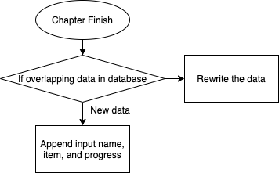

# Unit 1: A classic game 


# Criteria A: Planning

## Problem definition

The owner of the local game shop is an enthusiast of classic computer games. He has been looking for a talented programmer that can help him revive his passion for text-based games. He has few requirements for this task:

1. The game has to be entirely text-based.
2. The game must record the time played.
3. The game must record the player name and score.

Apart for this requirements, the owner is open to any type of game, topic or genre.

## Proposed Solution
### Statement
I will design and create a text-based game for a client who is the local game shop. The category of the game will be a RPG mystery game and will be created in python 3.7. The game will be made in the duration of 3 weeks and will be evaluated according to the criteria.

### Description of the Game
The game is called “Ember”. The game is about 2 male teenagers going into the famous haunted house in the forest for their lost friend. Through this research, the main character will encounter mysteries of the house and find out what is the truth behind everything of the incidents around the house. The game is a RPG mystery game with little horror essence included. The time limit of the game is 1hour. Throughout the game, the player will make various decisions based on the area they are in, and depending on the selection the game can change drastically. For instance, to make it to the true ending, the player will be required to make one specific choice at the early stage of the game. During the game, there will be quizzes. The quizzes that appear during the game are mostly original. However, some of them are famous riddles, some of them are based on IQ tests. As the player makes progress and goes to different chapters, the progress will be saved into another file. There are three types of endings, countless decisions. I made it as challenging as possible so that the player can enjoy the game.

### Justification 
For coding the game, I will be using Python 3.7. since this is the only language I can create a product. The coding will contain all the knowledge I earned during the computer science classes. The OS will be macbook Catalina, this is because as I did some research, I found out that python now fully supports Macbook OS. The application will be pycharm, the reason for this is because pycharm has easy to see error highlights which is very helpful for coding beginners like me. Additionally, pycharm has high processing speed and allows me to do more effecient coding.

## Success Criteria
### 1. The game has to be entirely text-based.
### 2. The game must record the time played.
### 3. The game must record the player's name and score.
### 4. The game will provide a checkpoint for each chapter.
### 5. The game will have a survey at the end which measures the satisfactory level.
### 6. The game will provide three different types of ending.

# Criteria B: Design

## System Diagram


## Flow Diagrams
### Chapter Flow (While statement True loop)
*It is just an example and so the details are not shown.*


### Saving System


### Loading System


## Record of Tasks
| Task No | Planned Action                          | Planned Outcome                                                                                                                          | Time estimate | Target completion date | Criterion |   |   |
|---------|-----------------------------------------|------------------------------------------------------------------------------------------------------------------------------------------|---------------|------------------------|-----------|---|---|
| 01      | Time and Score for the game             | A system to measure the time and score the user took.                                                                                    | 10min         | 2021.Sep.23            | C         |   |   |
| 02      | Recording database for Game             | Database for the user's name, time to finish the game, and the score.                                                                    | 10min         | 2021.Sep.25            | C         |   |   |
| 03      | Unit Test: Caesar Cypher Encoding       | To check the function works as expected. Test with the input of "Hello" with code of 3, the outcome becomes "Khoor".                     | 10min         | 2021.Sep.26            | C         |   |   |
| 04      | Construction of big picture of the game | Timeline and outline of the whole game for more efficient progress.                                                                      | 2hours        | 2021.Sep.28            | A         |   |   |
| 05      | Side character death function           | Function that kills the side character in story.                                                                                         | 20min         | 2021.Sep.28            | C         |   |   |
| 06      | Underplot for the TRUE END              | Path to secret true ending: Upon specific input from the user at the first decision.                                                     | 1hour         | 2021.Sep.29            | C         |   |   |
| 07      | While statement true loop               | While the main character is in certain room, the while loop will happen and show choices accordingly                                     | 1week         | 2021.Oct.29            | C         |   |   |
| 08      | Inventory system                        | Inventory system to save items, which will be needed later on the game.                                                                  | 1day          | 2021.Oct.6             | C         |   |   |
| 09      | Text file                               | Save all the long paragraphs that appears during the game. Putting in different file and making it a function for easier access and use. | 10min         | 2021.Oct.6             | C         |   |   |
| 10      | Play sound                              | Sound playing system using afplay. Used for sound effect in the game.                                                                    | 2hours        | 2021.Oct.7             | C         |   |   |
| 11      | MVP                                     | Create a minimum viable product for seniors to play and receive feedback from them for further improvements.                             | 2weeks        | 2021.Oct.8             | C         |   |   |
| 12      | Checkpoint                              | Create a checkpoint lists for saving players process every chapter. (On every ending of chapter, "Chapter N" Will be added)              | 2hours        | 2021.Oct.14            | C         |   |   |
| 13      | Saving system                           | A saving system that saves username, item and progress(checkpoint list) into gamesave.txt.                                               | 30min         | 2021.Oct.18            | C         |   |   |
| 14      | Loading system                          | A loading system that loads the saved variables from gamesave.txt.                                                                       | 30min         | 2021.Oct.18            | C         |   |   |
| 15      | Confirmation for success criteria       | Check if the whole game meets the success criteria.                                                                                      | 2hours        | 2021.Oct.22            | C         |   |   |
| 16      | Flow diagrams                           | Draw flow diagrams for While statement true loop, Saving system and Loading system.                                                      | 1hour         | 2021.Oct.23            | B         |   |   |


## Test plans

| Description                                                   | Type             | Input                                                                                    | Expected Output                                                                                                |
|---------------------------------------------------------------|------------------|------------------------------------------------------------------------------------------|----------------------------------------------------------------------------------------------------------------|
| Caesar Cypher Encoding Program for Usernames                  | Module Test      | "Hello"                                                                                  | "Khoor"                                                                                                        |
| Database for [Username], [Time taken to finish game], [Score] | Module Test      | Player named "Matsu" finished the game with 200seconds.                                  | Appends {["Matsu"], [200.21], [3400]} into database file                                                       |
| Function [RYU_D] (Side character death function)              | Module Test      | Player makes specific decisions after entering the door without [Fallen] Statement False | Print("Ryu DIED"), make ryu_dead statement and fallen statement True                                           |
| Function [ROUTE3] (True ending function)                      | Module Test      | Player makes specific decision before opening the door                                   | Print("Ryu found a teddy bear"), append [Bear] into inventory, make fallen statement True                      |
| Sound playing module                                          | Module Test      | After event                                                                              | Play sound from selected mp3 file.                                                                             |
| Inventory lists                                               | Module Test      | Player finds append-able item                                                            | Append selected items into [Inventory] lists                                                                   |
| Room statement true                                           | Module Test      | When player enters room                                                                  | Make entered Room statement True, and previous room sstatement False                                           |
| While statement True loop'                                    | Module Test      | When room statement True                                                                 | Print(Room details) + input(player decisions).                                                                 |
| Run Chapter1                                                  | Integration Test | Run through chapter1 with various inputs on all decisions                                | No bugs, function effectively used, compatibility in global statements.                                        |
| Run Chapter2                                                  | Integration Test | Run through chapter2 with various inputs on all decisions                                | No bugs, function effectively used, compatibility in global statements, quizes working.                        |
| Run Chapter3                                                  | Integration Test | Run through chapter3 with various inputs on all decisions                                | No bugs, function effectively used, compatibility in global statements, quizes working.                        |
| Run Ember                                                     | System Test      | Run through the whole game for all endings.                                              | No bugs, function effectively used, compatibility in global statements, quizes working, all endings reachable. |
| Satisfaction checker                                          | Module Test      | Player inputs satisfactory level from the scale of 1 to 5.                               | If validable input, append to Satisfactory.txt, if invalid input, repeat question.                             |

## Criteria C: Code
```diff
-Additonal File will be needed to run the code
```
```.py
import os

from clearconsole import clear
import time
import subprocess
ryu_dead = False
fallen = False
inventory = []
savepoint = []
lived = True
in_entrance = False
def clear():
    os.system('clear')

def save():
    with open("gamesave.txt","a") as file:
        file.write(f"{name},{savepoint}\n")
def load():
    with open("gamesave.txt","r") as file:
        file.read(f"{name},{savepoint}")
def RYU_D():
    subprocess.call(["afplay", "fall.mp3"])
    print("The storage room suddenly collapsed, and Ryu was crushed by the falling woods. ")
    print("------Ryu DIED------")
    print("You: No way. Why. If we did not rush into the house, maybe he could have lived...\n"
          "For both Ryu and Koji, I will expose the truth of this house..!!")
    global ryu_dead
    ryu_dead = True
    global fallen
    fallen = True
def ROUTE3():
    print(f"Ryu: {name} Look at this!!! ")
    print("Ryu found a old stuffed mocha colored bear doll\f"
          "I will put it in your bag!!!")

    print(f"Ryu stored the [Bear] in your bag")
    inventory.append("Bear")
    subprocess.call(["afplay", "fall.mp3"])
    print("Ryu:What was that sound?!")
    print("It looks like the room on the left side of the house collapsed")
    print(f"Ryu:This is getting interesting...!! Lets go {name}!!!")
    print(f"You chase Ryu and now you have made your step into the house... ")
    global fallen
    fallen = True
def OPEN1():
    '''
    Object = input(" ")
    object = Object.lower()
    #with open("object_Chp1.txt", "r") as file:
    if object != "door":
        while object != "door":
            Object = input("There seems no object like that... Reselect ")
            object = Object.lower()
    if object == "door":
    '''

    action = input(f"Would you like to open the door? ")
    action = action.lower()
    route3 = 0
    if "open" in action:
        print("You opened the door and now you have made your step into the house... ")
        global fallen
    elif "y" in action:
        print("You opened the door and now you have made your step into the house... ")
    elif "yes" or "open" not in action:
        global fallen
        fallen = True
        print(f"Ryu: {name} Look at this!!! ")
        print("Ryu found a old stuffed bear doll\n"
              "Ryu: I will put it in your bag!!!")

        print(f"Ryu stored the [Bear] in your bag")
        inventory.append("Bear")
        subprocess.call(["afplay", "fall.mp3"])
        print("Ryu:What was that sound?!")
        print("It looks like the room on the left side of the house collapsed")
        print(f"Ryu:This is getting interesting...!! Lets go {name}!!!")
        print(f"You chase Ryu and now you have made your step into the house... ")


        #else:
            #action = input(f"Invalid action, enter reselect or different to select another object \n"
                           #f"Would you like to open the {object}? ")

# now, to clear the screen
time_limit = 3600

print("\n"
      "In the deep woods of a suburb part of Tokyo, there is a strange Abandoned house. \n"
      "Although the house was burned down from an incident a few decades ago, \n"
      "the house has never collapsed yet, and keeps its shape with dark carbonized wood planks. \n"
      "As the sky gets darker and darker, the house shades into the gloom of night. \n"
      "Once you enter the forest, the smell drills into your nose.  The scent of burned woods, and something else... \n"
      "\n"
      "From the ominous atmosphere, the house has countless dark rumours. \n"
      "Some say that the house was used as a military experiment, \n"
      "some say that the haunt of god caused a fire, \n"
      "some say that an arsonist attacked the house. \n"
      "Additionally, from the occult trend, young people enter the house just for entertainment.\n"
      "There were just two ways of consequences for them. \n"
      "It was either they survive back with a serious scald, or scatter as an ash. \n"
      "\n"
      "No one knows who is denying, and eliminating the intruders. \n"
      "To unveil the truth of the burned house, another pair of teenagers opens the door…\n")
"\n"
"\n"
"\n"

print("        [Ember, the memory of Inferno]          \n"
      " ▓█████   ███▄ ▄███▓  ▄▄▄▄    ▓█████   ██▀███ \n"
      " ▓█   ▀  ▓██▒▀█▀ ██▒ ▓█████▄  ▓█   ▀  ▓██   ██▒\n"
     " ▒███    ▓██    ▓██░ ▒██▒ ▄██ ▒███    ▓██   █▒\n"
     " ▒▓█  ▄  ▒██    ▒██  ▒██░█▀   ▒▓█  ▄  ▒██▀▀█▄ \n"
     " ░▒████▒ ▒██▒   ░██▒ ░▓█  ▀█▓ ░▒████▒ ░██▓  ██ \n"
     " ░░ ▒░ ░░ ▒░   ░  ░ ░ ▒▓███▀▒ ░░ ▒░ ░░ ▒▓    ▒▓ \n"
      "░ ░  ░░  ░      ░▒░▒   ░  ░ ░  ░  ░▒ ░ ▒░\n"
      " ░   ░      ░    ░    ░    ░     ░░   ░ \n"
        " ░  ░       ░    ░         ░  ░   ░ \n "
          "              ░       \n ")


name = input("Enter your name ")
clear()

print(f"Ryu:Yo! {name} hurry up, The police is gonna come!\n")
print("You and Ryu has came to explore the abandoned house to know what was going on, \n"
      "and for the sake of Koji, Who went missing after he came to this house"
      "\n")
print(f"Ryu:Why did you have to break the fence?! Because of that now we only have ONE HOUR!!!\n"
"You have one hour to search through the house, until the police comes\n")
start = time.time()
print("Ryu:Look at this door... Its actually burned and its still holding the shape")
OPEN1()
clear()
print("The first thing you feel is a keen cold aura that is filling the whole building. \n"
      "You have entered the Entrance room \n")

if fallen == True:
    print("Where is Ryu?")
    print("Ryu dashed into the house so fast and now we lost him\n")

print("You have few options for what do next:\n"
      "In the front, there is a door. However, it is tightly locked with a chain\n"
      "On your right, there is a room with opened door\n"
      "On your left, there is another room, and has sign that says [storage room]\n"
      "Or go back to the door you just came in")
in_entrance = True
open_room = False


def chapter1():

    global in_entrance
    while in_entrance == True:
        dec1 = input("You are in the -Entrance- \n"
                     "Select a direction ")
        if "front" in dec1:
            global fallen
            if fallen == False:
                print("Ryu: I will go to the storage room!!!")
                RYU_D()
                fallen = True
                in_entrance = True

            elif fallen == True:
                if "Chain Cutter" in inventory:
                    print("You roughly cut all the chains that was locking the door, \n"
                          "it looks like the blocked door was leading to the main hall of this house\n")
                    dec3 = input("Would you like to open the door?")
                    if "y" in dec3:
                        print("The door is locked with a keylock")
                        if "Key" in inventory:
                            dec4 = input("Would you like to use the key? ")
                            if "y" in dec4:
                                inventory.remove("Key")
                                in_entrance = False
                                global main_hall
                                main_hall = True
                                savepoint.append("Chapter1")
                                save()


                        elif "Key" not in inventory:
                            print("You have to find a key")
                            in_entrance = True
                elif "Chain Cutter" not in inventory:
                    print("The door is completely strangled. Find something to break it")
                    in_entrance = True


                else:
                    print("Invalid selection")
                    in_entrance = True
        if "right" in dec1:
            if (fallen == False) and (ryu_dead == False):
                print("Ryu: You're going there? I will go to the storage room!!!")
                RYU_D()
                fallen = True
                in_entrance = True

            elif fallen == True:
                print("You have entered the -Closet Room-")
                open_room = True
                print("In the room, there are few half burned coats hanging on the hanger rack\n"
                      "and on the further end of the room, there is a calendar.\n"
                      "Behind you is the door to entrance")
                while open_room == True:
                    dec2 = input("You are in the -Closet Room-. Select an object you like to see ")

                    if ("rack" in dec2) or ("hanger" in dec2) or ("coat" in dec2):
                        print("There are three coats:\n"
                              "A quarter burned blue coat, \n"
                              "Unburned yellow coat,\n"
                              "and a half burned red coat")
                        Coat = True
                        while Coat == True:
                            dec3 = input("Select a coat ")
                            if "red" in dec3:
                                if "Key" not in inventory:
                                    print("The red coat had a pocket. And inside the pocket, there was key")
                                    key = input("Would you like to take the key?")
                                    if "y" in key:
                                        print("You stored [Key] in your bag")
                                        inventory.append("Key")
                                        open_room = True
                                        Coat = False
                                    elif "n" in key:
                                        open_room = True

                                if "Key" in inventory:
                                    print("Red coat with a pocket")
                                    open_room = True
                                    Coat = False

                            elif "blue" in dec3:
                                print("It looks like the coat is burned too much and there is nothing to see")
                                open_room = True
                                Coat = False

                            elif "yellow" in dec3:
                                print("There is a newspaper sticking out from the yellow coat")
                                dec4 = input("Would you like to read the newspaper? ")
                                if "y" or "r" in dec4:
                                    from text import newspaper

                                    newspaper()
                                    print("The rest of newpaper is unreadable")
                                    print("You stored [Newspaper] in your bag")
                                    inventory.append("Newspaper")
                                    open_room = True
                                    Coat = False

                    if "calendar" in dec2:
                        print("A calendar for year 1923, July")
                        open_room = True

                    if ("back" or "behind" or "door") in dec2:
                        open_room = False
                        in_entrance = True
        if "left" in dec1:
            if ryu_dead == False and fallen == False:
                subprocess.call(["afplay", "fall.mp3"])
                print("The ceiling suddenly collapsed and you got crushed by the dark woods")
                print("---GAME OVER---")
                print("Ending:「Dead End」")
                var = lived == False
                quit()

            if fallen == True and ryu_dead == True:
                print("You can see Ryu's arm sticking out of the woods and rocks.")

                if  "Chain Cutter" not in inventory:
                    print("There is a chain cutter next to his arm")
                    dec2 = input("Would you like to take the chain cutter?")
                    if "y" in dec2:
                        print("You stored [Chain Cutter] in your bag")
                        inventory.append("Chain Cutter")
                    else:
                        in_entrance = True
                if "Chain Cutter" in inventory:
                    in_entrance = True

            if ryu_dead == False:
                print("The room is a disaster from the collapse.")
                if "Chain Cutter" not in inventory:
                    print("Inside the pile of rocks, you find a Chain cutter")
                    dec2 = input("Would you like to take the chain cutter?")
                    if "y" in dec2:
                        print("You stored [Chain Cutter] in your bag")
                        inventory.append("Chain Cutter")
                    elif "n" in dec2:
                        in_entrance = True
                if "Chain Cutter" in inventory:
                    in_entrance = True
        if "back" in dec1:
            if (fallen == False) and (ryu_dead == False):
                print("Ryu: You're going there? I will go to the storage room!!!")
                RYU_D()
                fallen = True
                in_entrance = True
            elif fallen == True:
                print("The door is locked")
                in_entrance = True
chapter1()
clear()
if "Chapter1" in savepoint:
    def chapter2():
        global main_hall
        if main_hall == True:
            print("Now you have made your way to the main hall of the mansion, and the first thing that came into your vision\n"
                  "was a colossal staircase leading to the mezzanine with two doors on the sides, and a stained glass window\n"
                  "on your frontal. On your right, there was a dark corridor, and you can not see the depths. It is the exact\n"
                  "same for the left side, however, there is a wooden statue of a Japanese god next to the entrance of the\n"
                  "corridor. The door to the entrance is right behind you. \n")

            main_hall = True

        l_ped = False
        r_ped = False
        flame = False

        while main_hall == True:
            dec1 = input("Select your next direction ")
            if ("front" or "up" or "stair")in dec1:
                print("You have walked up to the mezzanine, and you can see two doors. \n"
                      "The one on the right says, -Library- \n"
                      "The one on the left says, -Bedroom- \n")
                up = True
                main_hall = False
                while up == True:
                    dec2 = input("Which room would you like to enter?\n"
                                 "You can also go back to the main hall ")
                    if ("library" or "right") in dec2:
                        up = False
                        library = True
                        print("You are in the -Library-")
                        print("The room has book shelf on both endings of the room, however it is filled\n"
                              "with loads of burned books. There is also a table that is sitting right in front\n"
                              "of you that has few half burned books on it.\n"
                              "There is also a strange security box with weirdly shaped key lock on it\n"
                              "And behind you is the door you came from\n")
                        while library == True:
                            print("You are in the -Library-")
                            dec3 = input("What would you like to look at?" )
                            if ("table" or "front" or "book") in dec3:
                                print("It looks like there are few books that has visible title:\n"
                                      "     Energy Manipulation\n"
                                      "     Pyrokinetic\n"
                                      "     Manual of Pyrokinesis\n"
                                      "     Mind Control\n"
                                      "     Empowering Sixth Sense\n")
                                library = True
                            if ("back" or "door") in dec3:
                                library = False
                                up = True
                            if ("right" or "shelf" or "left" or "side") in dec3:
                                print("Countless amount of burned books")
                            if "box" in dec3:
                                print("A strange stone security box with a weirdly shaped key lock")
                                if "Weirdly Shaped Key" in inventory:
                                    dec4 = input("Would you like to open the box with the key?")
                                    if "y" in dec4:
                                        print("Inside the box, there was few pieces of paper that was used as a diary")
                                        dec5 = input("Would you like to read the diary?")
                                        if "y" in dec5:
                                            from text import dad
                                            dad()
                                            library = True
                                            flame = True
                                        if "n" in dec5:
                                            flame = True
                                            library = True


                                if "Weirdly Shaped Key" not in inventory:
                                    print("You need to find the key for the lock")
                                    library = True
                    if ("back" or "down" or "main") in dec2:
                        up = False
                        main_hall = True
                    if ("left" or "bedroom") in dec2:
                        print("Inside the bedroom, there was nothing but some ashed furniture. ")
                        up = True
            if "right" in dec1:
                rway = True
                main_hall = False
                while rway == True:
                    print("At the end of corridor, there was a stone pedestal with some writings on it:\n"
                          "What is something you can hold with your right hand, but not your left hand?")
                    ans1 = input("Answer:")
                    if "left" in ans1:
                        print("Fill in the missing number\n"
                              "23, 29, ???, 75, 110, 0")
                        ans2 = input("Answer:")
                        if ans2 == "47":
                            print("The stone pedestal moved horizontally and a lever appeared")
                            dec3 = input("Would you like to pull down the lever?")
                            if "y" in dec3:
                                print("You pulled down the lever and a weird noise occurred from the main hall")
                                r_ped = True
                                rway = False
                                main_hall = True
                            if "n" in dec3:
                                print("The pedestal moved back to where it was")
                                rway = False
                                main_hall = True
                        if ans2 != "47":
                            rway = True
                    if "left" not in ans1:
                        rway = True
            if "left" in dec1:
                lway = True
                main_hall = False
                while lway == True:
                    print("At the end of corridor, there was a stone box with some writings on it:\n"
                          "I am lighter than the feather. Yet, the strongest man can not hold me for 5minutes")
                    ans1 = input("Answer:")
                    if "breath" in ans1:
                        print("")
                        ans2 = input("Answer:")
                        if "" in ans2:
                            print("The stone box opened and a button appeared")
                            dec2 = input("Would you like to press the button?")
                            if "y" in dec2:
                                print("You pushed the button and a weird noise occurred from the main hall")
                                l_ped = True
                                lway = False
                                main_hall = True
                            else:
                                lway = False
                                main_hall = True
                        else:
                            lway = True
                    else:
                        lway = True
            if ("back" or "door") in dec1:
                main_hall = False
                in_entrance = True
            if (l_ped == True) and (r_ped == True) and ("Weirdly Shaped Key" not in inventory):
                print("The wooden statue next to the entrance of the corridor has opened its\n"
                      "mouth and there was a Weirdly Shaped Key inside the mouth. \n")
                dec2 = input("Would you like to take the key?")
                if "y" in dec2:
                    inventory.append("Weirdly Shaped Key")
                    print("You stored the [Weirdly Shaped Key] into your bag")
                    main_hall = True
                if "n" in dec2:
                    flame = True
                    main_hall = True
            if flame == True:
                print("The statue suddenly started burning. And correlating to that, the main hall\n"
                      "started burning. The fire is starting to surround you, the \n"
                      "deadly heat is suffering your body. You look around for a way to escape from the situation.\n"
                      "Both of the corridors are just a dead end, the stairs are burning too much to walk on,\n"
                      "and the door to the entrance is locked. You are in the worst situation you could think of.\n"
                      "As your last gasp, you run around the entrance...\n"
                      "\n"
                      "\n"
                      "And you found a concrete door with three alphabets engraved the letters are:\n"
                      "[F] [S] [F]"
                      "And there is also a three digit numeric code lock.")
                ans1 = input("What is the code?")
                if ans1 == "292":
                    main_hall = False
                    global concrete_room
                    concrete_room = True
                    savepoint.append("Chapter2")
                    save()
                if ans1 != "292":
                    print("The code was incorrect, and the flame blazed you to death...")
                    print("---GAME OVER---")
                    print("Ending:「Burn to Death」")
                    exit()
    chapter2()
clear()
if "Chapter2" in savepoint:
    from Encoder import flame_end
    def chapter3():
        savepoint.remove("Chapter1")
        if concrete_room == True:
            print("The concrete door's key lock opened, and there was a narrow path. As you \n"
                  "walk through the way, you noticed that the path was leading to another room.\n"
                  "The room was a small concrete room with a fairly big chimney. At the middle,\n "
                  "there is a chair with helmet shaped machine hanging on the back of the chair.\n"
                  "On the table placed right next to you, there is a metal stick with burned tip,\n"
                  "and some metal hand cuffs...\n"
                  "\n"
                  "You have entered the -Training Room-\n")

            dec1 = input("What would you like to do? ")

            print("It was all in a sudden, an image strongly appeared into your brain. And a cry of girl...\n"
                  "Girl: Papa... I don't wanna do this anymore!!!\n"
                  "\n"
                  "Man: NO. STAY HERE.\n"
                  "\n"
                  "Girl: But the flame is getting stronger... I'm gonna die!!!\n"
                  "\n"
                  "Man: It is fine. You have the SPECIAL POWER. It is fine.\n"
                  "\n"
                  "Girl: I don't have special power!!!! Papa stop!!!\n"
                  "\n"
                  "\n")
            print("After a tiny pause, the image restarts from a different scene.\n"
                  "Man: Himiko, today for your further improvements and our family's bright future,\n"
                  "You will be doing training that is only for the chosen ones\n"
                  "\n"
                  "Himiko: Please stop... Please...\n"
                  "\n"
                  "Himiko's Father: SIT ON THIS CHAIR.\n"
                  "\n"
                  "\n"
                  "\n")
            print("You: What was that...?\n"
                  "\n"
                  "???: That is the truth\n"
                  "\n"
                  "You: Are you Himiko...?\n"
                  "\n"
                  "Himiko: My soul is chained to this house. \n"
                  "\n"
                  "You: What do you mean by that was the truth?\n\n"
                  "Himiko: I was just tool for my father. He forced me to do the unnecessary training, which basically was \n"
                  "just a torture. He locked me up and made me stay in front of the flame for about 3hours, and whenever I \n"
                  "refused to do the training, he hit me with that metal stick. Sometimes, he heated the stick and hit me \n"
                  "with it And after about 2months of training, he killed me. He tried to bloom my special ability by \n"
                  "giving a shock to my brain. Which was cause of my death. The electricity was too strong.\n "
                  "\n"
                  "You: What do you mean by unnecessary? \n\n"
                  "Himiko: There was no special ability in me. I was just an ordinary girl. But after my father has went\n"
                  "from the company's bankrupt, he started saying that I have special power. All the shows we have done\n"
                  "was just a fake show. And from all these suffer, my grudge embodied and this spiritual form gave me\n"
                  "real pyrokinetic power to burn down this house and burn my father to death.\n\n"
                  "You: Why did you kill all the people who came to this house..?\n\n"
                  "Himiko: There is no reason. Their foolishness was just annoying.\n\n"
                  "You: ...And that is why you killed my friend... You could have done different!!!\n\n"
                  "Himiko: WHAT DO YOU MEAN I COULD HAVE DONE DIFFERENT!? WHAT DO YOU KNOW ABOUT ME!? \n\n"
                  "You: ...\n\n")

            print("Himiko: When is my birthday.")
            ans1 = input("Year ")
            ans2 = input("Month ")
            ans3 = input("Date ")

            if (ans1 == "1909") and ((ans2 == "4") or (ans2 == "April")) and (ans3 == "20"):
                print("Himiko: Right. Next \n"
                      " [1] is [Sunday] \n"
                      " [12] is [Thursday] \n"
                      " [23] is [Monday] \n"
                      " What day is [31] \n")
                ans4 = input("Answer: ")
                if ans4 == "Tuesday":
                    print("Himiko: Okay.\n"
                          "[Red] is [2]\n"
                          "[Yellow] is [1]\n"
                          "What number is [Blue]?\n")
                    ans5 = input("Answer: ")
                    if ans5 == "4":
                        print("Himiko: ...What color is my teddy bear")
                        if "Bear" in inventory:
                            print("You:Mocha...?\n\n")
                            print("Himiko: ..!! How do you know?!\n")
                            print("You took out the teddy bear and gave it to Himiko")
                            print("Himiko: No way... Thank you... Thank you... I can finally leave peacefully\n")
                            print("Himiko started to fade away into the slight light of the dawn\n")
                            print("After the encounter with Himiko, you made you way out of the house.\n"
                                  "Ryu: YO! Why are you so late bro?\n")
                            print("---GAME CLEAR---")
                            print("True Ending")
                        if "Bear" not in inventory:
                            ans6 = input("Answer:")
                            print("Himiko: Incorrect. But I see that you really want me to leave this world.\n"
                                  "I guess I will never be loved by someone again.\n\n"
                                  "Himiko started to fade away like an ash.\n"
                                  "After all these search in this house, you made your way out of the house.\n"
                                  "---GAME CLEAR---\n"
                                  "Ending: Reluctance")
                        else:
                            flame_end()
                            exit()
                    else:
                        flame_end()
                        exit()
                else:
                    flame_end()
                    exit()

            else:
                flame_end()
                exit()

    chapter3()
end = time.time()
duration = end - start
score = time_limit - duration

from Encoder import secret_encoder
with open("database.txt", "a") as file:
    encoded_name = secret_encoder(3, name)
    file.write(f"{encoded_name},{duration:.2f},{round(score)}\n")
    print(f"You took {duration:.2f}sec to finish the game and your score is {round(score)}")


satisfactory = int(input("Please enter your satisfactory level on the scale of lowest 1 to highest 5.\n"))
if satisfactory < 6:
    with open("Satisfactory.txt","a") as file:
        file.write(f"{name},{satisfactory}\n")
else:
    satisfactory = int(input("Enter your satisfactory level on the scale of lowest 1 to highest 5.\n"))

```
